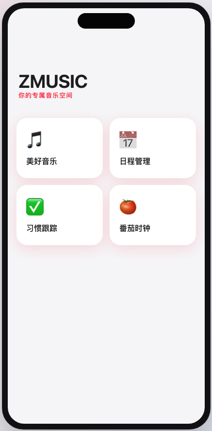
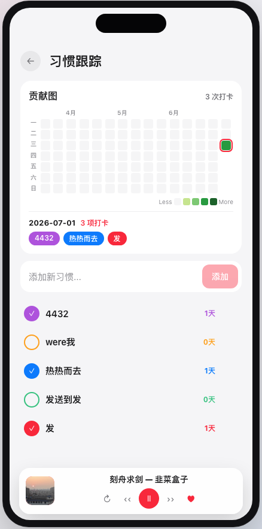

# ZMUX

一款音乐播放软件，支持 网易云 、 QQ音乐 、 酷我音乐 、 JOOX等平台的音源。基于 tauri 跨平台多终端。

在线体验： https://vongdefu.github.io/zmux .

> [!NOTE]
> 项目还在快速迭代过程中，并且由于个性化歌曲信息都存在本地，所以有丢失歌单和收藏的风险，作者正在快马加鞭修复....

## 功能介绍

- 歌曲搜索
- 我的收藏
- 自建歌单
- 歌曲播放：
  - 收藏
  - 下载
  - 上一曲、下一曲、暂停
  - 进度条
  - 快捷键控制
  - 音量控制
  - 歌词滚动
  - 播放模式
    - 列表循环
    - 单曲循环
    - 随机播放

## Screenshots

<table align="center">
  <thead>
    <tr>
      <th align="center" width="180">功能模块</th>
      <th align="center" width="150">子模块</th>
      <th align="center">功能截图</th>
    </tr>
  </thead>
  <tbody>
    <tr>
      <td align="center"><b>主页</b></td>
      <td colspan="2">
        
      </td>
    </tr>
    <tr>
      <td rowspan="3" align="center"><b>美好音乐</b></td>
      <td align="center">推荐歌单</td>
      <td>
        
        
      </td>
    </tr>
    <tr>
      <td align="center">我的</td>
      <td>
        
        
        
      </td>
    </tr>
    <tr>
      <td align="center">歌曲播放</td>
      <td>
        
      </td>
    </tr>
    <tr>
      <td align="center"><b>日程管理</b></td>
      <td colspan="2">
        
      </td>
    </tr>
    <tr>
      <td align="center"><b>习惯跟踪</b></td>
      <td colspan="2">
        
      </td>
    </tr>  
    <tr>
      <td align="center"><b>番茄时钟</b></td>
      <td colspan="2">
        
      </td>
    </tr>
  </tbody>
</table>

## TODO

- [ ] 功能与特性
  - [ ] 悬浮进度条+滚动歌词
  - [ ] 播放本地音频文件
  - [ ] 整合各大平台
  - [ ] 数字时钟： https://github.com/liguobao/web-clock
  - [ ] 经典歌单
    - 去网上找歌曲名的列表，按照元数据自动播放；
- [ ] 文档
  - [ ] 截图
  - [ ] 开发
  - [ ] 构建过程
  - [ ] 启发
- [ ] 自动化构建
  - [ ] release notes 自动生成；
  - [x] iOS
  - [x] MacOS
  - [x] Web
  - [ ] brew
- [ ] 杂务
  - [ ] log制作
  - [ ] 保护release
  - [ ] 合并之前的提交记录；

## Sponsor

> 本软件并不需要梯子。

https://secure.shadowsocks.au/aff.php?aff=20045

打个广告，给大家推荐一款梯子服务商，外贸用的，用了五六年了。

- 节点多
- 延迟小
- 超级稳定。用了多年，可以说没有被封过。
- 人工服务响应专业、即时。
- ......

## 开发过程

```bash
## 查看 环境
yarn tauri info

## 启动 dev 客户端
yarn tauri dev

## 构建
yarn tauri build

## 增加 ios 客户端
yarn tauri ios init

## 安装xcode后在真机上测试
yarn tauri ios dev

## 构建，之后可以通过xcode工具把软件安装到真机上
yarn tauri ios build

## 构建，在模拟器上构建
yarn tauri ios dev "iPhone 17 Pro Max"

git tag v1.0.0
git push origin v1.0.0
```

## Star History

<a href="https://www.star-history.com/?repos=vongdefu%2Fzmux&type=date&legend=bottom-right">
 <picture>
   <source media="(prefers-color-scheme: dark)" srcset="https://api.star-history.com/chart?repos=vongdefu/zmux&type=date&theme=dark&legend=top-left" />
   <source media="(prefers-color-scheme: light)" srcset="https://api.star-history.com/chart?repos=vongdefu/zmux&type=date&legend=top-left" />
   
 </picture>
</a>

## Inspired

[musicsquare](https://github.com/CharlesPikachu/musicsquare)
